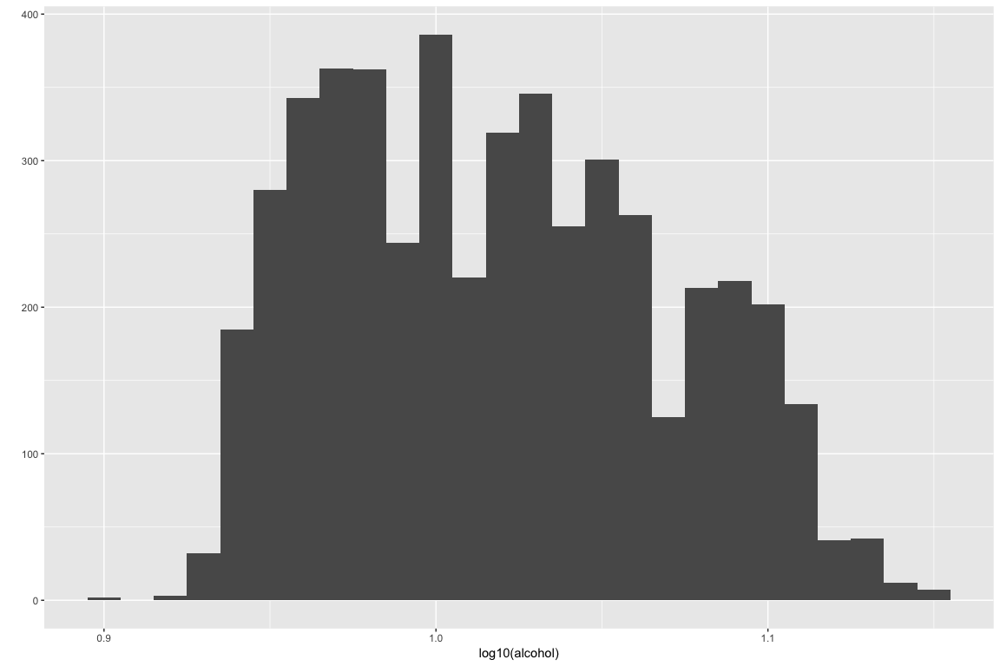
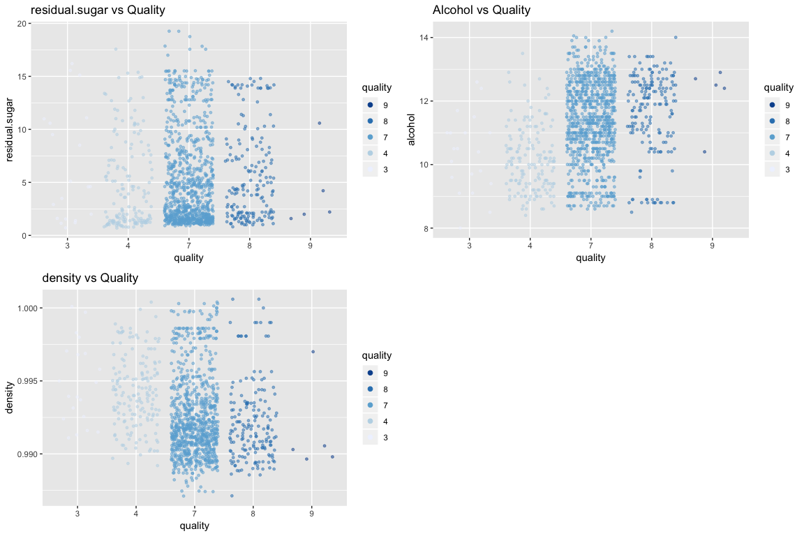

---
output:
  html_document:
    keep_md: yes
---

White Wine Data Exploration by Shenghao Xie 
========================================================
# Abstract:
I decide to explore how the quality of the red wine is influenced by its chemical composition. More information is in [here](https://s3.amazonaws.com/udacity-hosted-downloads/ud651/wineQualityInfo.txt)


# Univariate Plots Section


[1] "Dataset variables"

* fixed.acidity 
* volatile.acidity 
* citric.acid 
* residual.sugar 
* chlorides 
* free.sulfur.dioxide 
* total.sulfur.dioxide 
* density 
* pH 
* sulphates 
* alcohol 
* quality 

<!-- end of list -->

```
## [1] "Dataset structure"
```

```
## 'data.frame':	4898 obs. of  12 variables:
##  $ fixed.acidity       : num  7 6.3 8.1 7.2 7.2 8.1 6.2 7 6.3 8.1 ...
##  $ volatile.acidity    : num  0.27 0.3 0.28 0.23 0.23 0.28 0.32 0.27 0.3 0.22 ...
##  $ citric.acid         : num  0.36 0.34 0.4 0.32 0.32 0.4 0.16 0.36 0.34 0.43 ...
##  $ residual.sugar      : num  20.7 1.6 6.9 8.5 8.5 6.9 7 20.7 1.6 1.5 ...
##  $ chlorides           : num  0.045 0.049 0.05 0.058 0.058 0.05 0.045 0.045 0.049 0.044 ...
##  $ free.sulfur.dioxide : num  45 14 30 47 47 30 30 45 14 28 ...
##  $ total.sulfur.dioxide: num  170 132 97 186 186 97 136 170 132 129 ...
##  $ density             : num  1.001 0.994 0.995 0.996 0.996 ...
##  $ pH                  : num  3 3.3 3.26 3.19 3.19 3.26 3.18 3 3.3 3.22 ...
##  $ sulphates           : num  0.45 0.49 0.44 0.4 0.4 0.44 0.47 0.45 0.49 0.45 ...
##  $ alcohol             : num  8.8 9.5 10.1 9.9 9.9 10.1 9.6 8.8 9.5 11 ...
##  $ quality             : int  6 6 6 6 6 6 6 6 6 6 ...
```

I printed the data types for each columns, it shows that the quality values are integers. Therefore, In this dataset, quality is defined as a discrete variable here. Additionally, total sulfur dioxide and free sulfur dioxide appeared to be continuous variables, but it seems to have some round issues in that the numbers have no decimals. I decide to judge them as continuous variables to do the analysis.

<!-- -->
Now, I want to switch this plot into a new one. I defined the quality as "bad"(quality < 5), "average"(5 <= quality < 7), "good"(quality >= 8).
<!-- -->


From the histograms above, we found that most of the quality ratings are either 5 of 6, with 6 being the most frequent. These white wines can be considered as "average quality".   

<!-- -->

```
##    Min. 1st Qu.  Median    Mean 3rd Qu.    Max. 
##   3.800   6.300   6.800   6.855   7.300  14.200
```
The fixed acidity distribution seems to be a normal distribution and the min, max, mean, and median value is show in the table along with the quartile stats.
<!-- -->

```
##    Min. 1st Qu.  Median    Mean 3rd Qu.    Max. 
##  0.0800  0.2100  0.2600  0.2782  0.3200  1.1000
```
The volatile acidity distribution seems to be a normal distribution and the min, max, mean, and median value is show in the table along with the quartile stats.
<!-- -->

```
##    Min. 1st Qu.  Median    Mean 3rd Qu.    Max. 
##  0.0000  0.2700  0.3200  0.3342  0.3900  1.6600
```
The citric acid distribution seems to be a normal distribution except that theres's abnormal data around 0.5. The min, max, mean, and median value is show in the table along with the quartile stats.
<!-- --><!-- -->

```
##    Min. 1st Qu.  Median    Mean 3rd Qu.    Max. 
## -0.2218  0.2304  0.7160  0.6432  0.9956  1.8182
```
The distribution of residual sugar in log10 scale indicates that there're two distribution.
<!-- -->

```
##    Min. 1st Qu.  Median    Mean 3rd Qu.    Max. 
## 0.00900 0.03600 0.04300 0.04577 0.05000 0.34600
```
The chlorides distribution seems to be a normal distribution and the min, max, mean, and median value is show in the table along with the quartile stats.
<!-- -->

```
##    Min. 1st Qu.  Median    Mean 3rd Qu.    Max. 
##    2.00   23.00   34.00   35.31   46.00  289.00
```
The free sulfur dioxide distribution seems to be a normal distribution and the min, max, mean, and median value is show in the table along with the quartile stats.
<!-- -->

```
##    Min. 1st Qu.  Median    Mean 3rd Qu.    Max. 
##     9.0   108.0   134.0   138.4   167.0   440.0
```
The total sulfur dioxide distribution seems to be a normal distribution and the min, max, mean, and median value is show in the table along with the quartile stats.
<!-- -->

```
##    Min. 1st Qu.  Median    Mean 3rd Qu.    Max. 
##  0.9871  0.9917  0.9937  0.9940  0.9961  1.0390
```
The density distribution seems to be a normal distribution and the min, max, mean, and median value is show in the table along with the quartile stats.
<!-- -->

```
##    Min. 1st Qu.  Median    Mean 3rd Qu.    Max. 
##   2.720   3.090   3.180   3.188   3.280   3.820
```
The pH distribution seems to be a normal distribution and the min, max, mean, and median value is show in the table along with the quartile stats.
<!-- -->

```
##    Min. 1st Qu.  Median    Mean 3rd Qu.    Max. 
##  0.2200  0.4100  0.4700  0.4898  0.5500  1.0800
```
The sulphates distribution seems to be a normal distribution and the min, max, mean, and median value is show in the table along with the quartile stats.
<!-- --><!-- -->

```
##    Min. 1st Qu.  Median    Mean 3rd Qu.    Max. 
##  0.9031  0.9777  1.0170  1.0189  1.0569  1.1523
```
# Univariate Analysis
### What is the structure of your dataset?
The dataset is composed of 4898 data of different white wine. For each we have data 12 different characteristics or features. Among them, there is a categorical variable -quality. From this variable I have created a new one clasyfing it into 3 categories according its rating. The remaining variables are physical and chemical properties.

### What is/are the main feature(s) of interest in your dataset?
Quality is largely related to a customer's desire to buy the product or not. I think it mainly depends on the chemical components in the wine.

### What other features in the dataset do you think will help support your \investigation into your feature(s) of interest?
I will investigate the relationship between the quality with acidity, pH, alcohol and residual sugar. 

### Did you create any new variables from existing variables in the dataset?
Yes. I categroized different wine qualities into three chunks, which is good, average and bad.
### Of the features you investigated, were there any unusual distributions? Did you perform any operations on the data to tidy, adjust, or change the form of the data? If so, why did you do this?
As I mentioned above, the distribution of residual sugar and alcohol is not normal distribution. I also did some operations on data in order to tidy the form of data. For example, in visualize alcohol and residual sugar, I performed log transformation in order to get better overview of the data.

# Bivariate Plots Section

I used the corrplot to observe the relationship between different variables.
<!-- -->
From corrplot above and the definition of positive correlations (which greater than 0.45 or less than -0.45), we know that residual.sugar and density, free.sulfur.dioxide and density, total sulfur dioxide and density and the negative correlations density and alcohol, total sulfur dioxide and alcohol, residual suhar and alcohol are positive correlations.Therefore from now on my parameters of interest are: -residual.sugar -alcohol -density -free.sulfur.dioxide -total sulfur dioxide

<!-- -->
Here, we noticed that there's some outliers in all plots. We need to remove them.
<!-- -->
We can roughly draw conclusion that the higher concentration of alcohol is, the better quality the wine got, and the lower the density is, the higher quality. Total sulfur dioxide seems to have no strong relation ship with quality in that the medium value of different wines with respective quality is alomost the same. From the box plot of residual sugar content, we can notice that wines which have average quality have more residual sugar. Moreover, the wines which have avarage or good quality seems to have more free sulfur dioxide than bad ones.


```
## # A tibble: 7 x 4
##   quality alcohol_mean alcohol_median     n
##   <ord>          <dbl>          <dbl> <int>
## 1 3              10.3            10.4    20
## 2 4              10.2            10.1   163
## 3 5               9.81            9.5  1457
## 4 6              10.6            10.5  2198
## 5 7              11.4            11.4   880
## 6 8              11.6            12     175
## 7 9              12.2            12.5     5
```
<!-- -->


```
## 
## 	Pearson's product-moment correlation
## 
## data:  alcohol and density
## t = -87.255, df = 4896, p-value < 2.2e-16
## alternative hypothesis: true correlation is not equal to 0
## 95 percent confidence interval:
##  -0.7908646 -0.7689315
## sample estimates:
##        cor 
## -0.7801376
```
<!-- -->
From the plot, we can see that the relationship between density and alcohol seems to be linear. So I a use a linear model to smooth the result.
<!-- -->


```
## 
## 	Pearson's product-moment correlation
## 
## data:  density and residual.sugar
## t = 107.87, df = 4896, p-value < 2.2e-16
## alternative hypothesis: true correlation is not equal to 0
## 95 percent confidence interval:
##  0.8304732 0.8470698
## sample estimates:
##       cor 
## 0.8389665
```
<!-- -->
From the plot, we can see that the relationship between density and residual Sugar seems to be linear.
<!-- -->


```
## 
## 	Pearson's product-moment correlation
## 
## data:  residual.sugar and alcohol
## t = -35.321, df = 4896, p-value < 2.2e-16
## alternative hypothesis: true correlation is not equal to 0
## 95 percent confidence interval:
##  -0.4726723 -0.4280267
## sample estimates:
##        cor 
## -0.4506312
```

<!-- -->
From the plot, we can see that the relationship between density and residual Sugar seems to be linear.
<!-- -->

# Bivariate Analysis
### Talk about some of the relationships you observed in this part of the \investigation. How did the feature(s) of interest vary with other features in \the dataset?
According to the graphs above given by different pairs, parameters which are most relative to quality are: residual sugar, alcohol, density.

We can conclude that a wine which tends to be in good quality is high in alcohol but not sweet and not dense. However, it's just a raw assumption in that I have not consider other chemical components in the wine to be different from others.
### Did you observe any interesting relationships between the other features \(not the main feature(s) of interest)?
The correlation matrix indicates that sulfur dioxide has an influence, however when I made the box plot between sulfur dioxide and quality, there's no strict relationship between them.
### What was the strongest relationship you found?
Apart from rate and quality, the strongest relation is given by residual sugar and density. The Pearson correlation value(PCV) is about 0.838. The PCV between alcohol and density is -0.78, and that between alcohol and residual sugar is -0.451.

# Multivariate Plots Section
I narrowed the variate I want to explore into residual sugar, alcohol, density and quality.

<!-- -->
In the scatter plots, we can see that the wines which have good quality has less residual sugar than others.But for those which have quality 9, the data is too sparse, this may lead to some mistakes when drawing assumptions.

Instead, We are going to repalce quality with rate. Rate has only 3 bins so we can combine some different data into same chunck.

<!-- -->

<!-- -->
Here, I created a 2D plot to see where the bad and good quality wine are allocated in terms of the 3 parameters. The data in "bad"" and "good" cannot be separated.


Now I will start to make linear model to see if quality can be related with 3 features.

```
## 
## Calls:
## m1: lm(formula = I(quality_num ~ residual.sugar), data = ww)
## m2: lm(formula = quality_num ~ residual.sugar + alcohol, data = ww)
## m3: lm(formula = quality_num ~ residual.sugar + alcohol + density, 
##     data = ww)
## 
## ============================================================
##                        m1            m2            m3       
## ------------------------------------------------------------
##   (Intercept)         5.987***      2.021***     90.313***  
##                      (0.020)       (0.117)      (12.374)    
##   residual.sugar     -0.017***      0.022***      0.053***  
##                      (0.002)       (0.002)       (0.005)    
##   alcohol                           0.354***      0.246***  
##                                    (0.010)       (0.018)    
##   density                                       -87.886***  
##                                                 (12.317)    
## ------------------------------------------------------------
##   R-squared           0.010         0.202         0.210     
##   adj. R-squared      0.009         0.202         0.210     
##   sigma               0.882         0.791         0.787     
##   F                  47.064       619.354       434.085     
##   p                   0.000         0.000         0.000     
##   Log-likelihood  -6331.187     -5802.158     -5776.812     
##   Deviance         3804.419      3065.298      3033.737     
##   AIC             12668.375     11612.317     11563.624     
##   BIC             12687.865     11638.303     11596.107     
##   N                4898          4898          4898         
## ============================================================
```

# Multivariate Analysis

### Talk about some of the relationships you observed in this part of the \investigation. Were there features that strengthened each other in terms of \looking at your feature(s) of interest?
I choose residual sugar, alcohol and densiy as my multivariate study. The correlation seems to be strong between them and wine quality, but when making the 2D desnity plot we can’t observe a real separation between the 2 popularion ( bad and good wines). This is confirmed by the analysis made with 3 models including each of the features according to its correlation (Pearson method) with quality.

When I do data analysis for problem solving I use this technique: choose the best of the best register versus worst of the worst refisters. Sadly the investigation confirms that when using this technique there is no strong correlation between these 3 variables and the wine quality.

### Were there any interesting or surprising interactions between features?
There were no such interesting interactions between four features. 

### OPTIONAL: Did you create any models with your dataset? Discuss the \strengths and limitations of your model.
I created 3 linear models starting with residual sugar and quality and update the model by adding one more attribute each time. However, the R squared value is pretty small, so the model is not ideal.

------

# Final Plots and Summary

### Plot One
<!-- -->

### Description One
I created a new column which represents the wine quality as 'bad', 'average' and 'good' by group diffent quality value. Then I plot the histogram to see the distribution of the whole dataset.

### Plot Two
<!-- -->

### Description Two
I chose corrplot as plot 2. It gives us a brief overview of the correlation between two different attributes. The color identifying whether these two varibles are positive(blue) or negative(red) correlation. The size of the circle reflect the absolute value of the correlation(the higher the bigger).

### Plot Three
<!-- -->

### Description Three
The 2D density plots illustrates that we cannot separate bad and good wines clearly. This means that imput variables are correlated together.


------

# Reflection
I roughly observed white wine dataset with 4898 registers and 14 wine attributes, I chose 3 of them to explore in that they seemed to be highly related to wine quality.

I made a linear model to combine three attributes, but the model seems not to be representative.

For further investigation we will need more data especially in bad and good ones in order to have a better predict.
