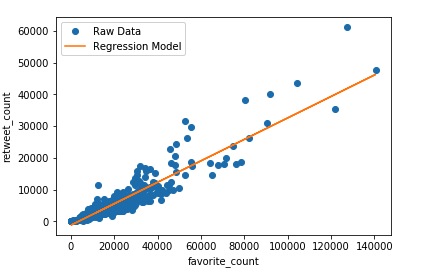
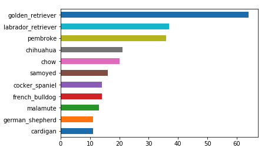
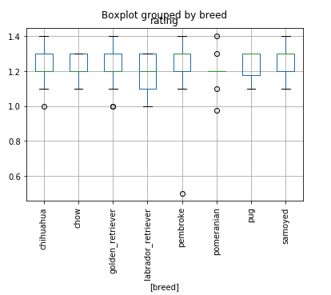
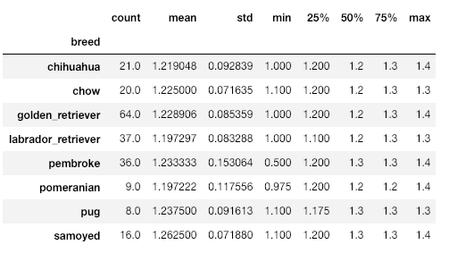

## Analysis of WeRateDogsTM

WeRateDogsTM is a twitter account that tweets out pictures of (mostly) dogs with their associated "ratings". Seems simple enough though, WeRateDogsTM has what one might call a different approach to a normal judge.

## About the Data
To analyze the tweets from WeRateDogsTM,  we used three different source files. The first one is an archive of the past tweets from [@dog_rates](https://twitter.com/dog_rates) provided via a CSV file from Udacity. The second one is from Twitter API used to retrieve more information to enhance the data in the first dataset. The last one is image prediction which predicted the breed of the dog in each picture.

## Find the Relationship between Favorites and Retweets
I first created a scatter plot of all tweets and the ideal linear model. Note that the actual relationship may not be linear, but it can give us a general idea of the two columns. You can see that most of the tweets received a comparably low retweet and favorite count.

Since the correlation coefficient is approximately 0.92, it indicates that there's a strong positive relationship between favorite_count and retweet_count.

## Most Common Dog Breeds
I first add two columns called breed and breed_conf, which stands for the kind of the dog in the tweet with its confidence value. We can see that 178 tweets cannot be identified as not a dog. The reason for this is that the image prediction may misclassify these images.

I plot 10 most common dog breeds in a bar chart. According to the plot, the most common dog is Golden Retriever, with almost 70 tweets. The following kinds are Labrador Retriever, Pembroke, Chihuahua, Pug, etc.

However, the result may be a little different from actual data, since the image prediction is not ideal. By taking a glimpse of the data, we see that some breed confidence are considerably low. In further investigations, the result of the image prediction model should be more precise.

## Ratings of Dog Breeds

In these eight breeds, Samoyed has the highest mean rating, Golden Retriever ranks the second, while pug is the lowest. All of these dogs have an average rating above 1. Therefore we can conclude that these are great dogs.

